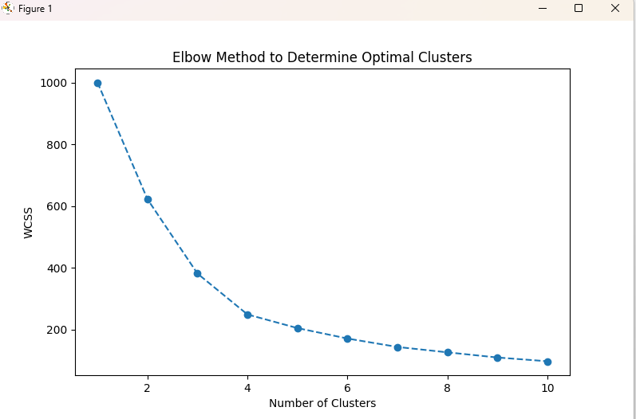
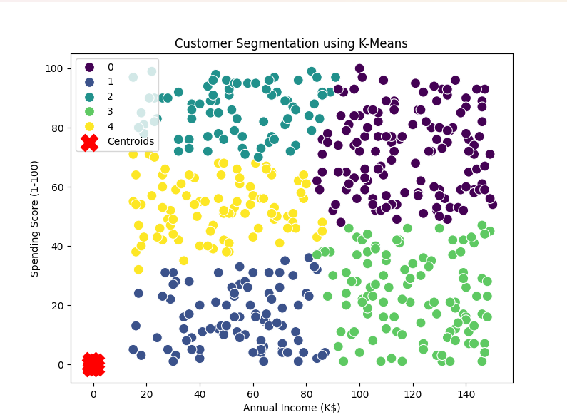

## Customer Segmentation with K-Means

This repository contains two Python scripts: `customer_main.py` and `random500_data.py`.

### 1. `customer_main.py`
`customer_main.py` performs customer segmentation using K-Means clustering. It processes customer data to identify distinct customer segments based on two key features: `Annual Income (k$)` and `Spending Score (1-100)`.

#### Requirements
- Python 3.x
- Libraries:
  - `numpy`
  - `pandas`
  - `matplotlib`
  - `seaborn`
  - `sklearn`

#### Steps in `customer_main.py`:
1. **Loading the Dataset**: 
   - The dataset `customers.csv` is read into a pandas DataFrame. It should be in the same directory as the script.

2. **Data Preprocessing**:
   - The script selects two features (`Annual Income (k$)` and `Spending Score (1-100)`) for clustering.
   - Standardizes the data using `StandardScaler` to ensure proper scaling for K-Means.

3. **Optimal Cluster Determination**:
   - Uses the Elbow Method to determine the optimal number of clusters by evaluating the within-cluster sum of squares (WCSS).

4. **K-Means Clustering**:
   - Applies K-Means clustering with the optimal number of clusters (5, based on the Elbow Method).
   - The predicted cluster labels are added to the dataset as a new column (`Cluster`).

5. **Visualization**:
   - A scatter plot is generated to visualize the customer segments with color-coded clusters.
   - The centroids of the clusters are marked in red with an "X".

   #### Elbow Method Plot
   The Elbow Method plot helps to determine the optimal number of clusters:
   

   #### Customer Segmentation Plot
   This scatter plot shows the customer segmentation with color-coded clusters and centroids marked in red:
   

#### How to Run:
1. Install the required dependencies:
   ```bash
   pip install numpy pandas matplotlib seaborn scikit-learn
